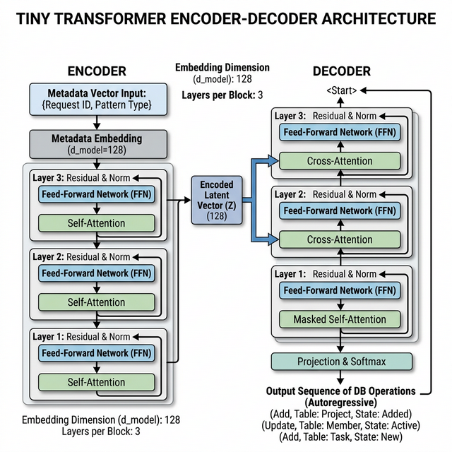

# Tiny Transformer for Structural Sequence Prediction in Database Workflows

## 1. Overview
This specification defines a **Tiny Transformer (Encoder-Decoder)** architecture optimized for local CPU inference (8-bit quantization). The model's primary task is to map a "Request ID" or "Metadata Vector" to a sequence of structured database operations. 

When encountering a NEW request ID, the model utilizes latent embeddings of request features (e.g., Pattern Type, Block relationships) to "guess" the correct workflow sequence.

## 2. Architecture: Tiny Transformer (Enc-Dec)

### 2.1 Configuration
- **Type**: Encoder-Decoder Transformer.
- **Layers**: 2 to 4 (L=2 per component recommended for extreme CPU efficiency).
- **Embedding Dimension ($d_{model}$)**: 128 or 256.
- **Attention Heads ($n_{heads}$)**: 4 to 8.
- **Feed-Forward Dimension ($d_{ff}$)**: 512.
- **Activation**: GELU.
- **Layer Normalization**: Pre-Norm architecture (more stable for small embedding sizes).

### 2.2 Latent Embeddings for Metadata
Instead of just a one-hot "Request ID," the encoder processes a **Metadata Vector** consisting of:
- **Pattern Type**: Categorical (Entity relationship pattern).
- **Block Relationship Map**: Graph-based or relational adjacency representation.
- **Contextual Features**: Origin of request, priority, etc.

These are mapped to a latent space that the decoder uses as context via cross-attention.



---

## 3. Tokenization Strategy: Structural Units

To maintain structural integrity, we define a **Unified Tuple Vocab**. Instead of tokenizing "Add," "Project," and "Added" separately, we map the triplet `(Action, Table, State)` to a single vocabulary unit.

### 3.1 Vocabulary Mapping
- **Total Triplets**: (4 Actions) × (9 Tables) × (3 States) = 108 combinations.
- **Special Tokens**: `[PAD]`, `[SOS]`, `[EOS]`, `[UNK]`.
- **Entities**: `project`, `revision`, `block`, `block_fk`, `vector`, `label`, `burst`, `pattern`, `phasing`.
- **Actions**: `add`, `remove`, `update`, `read`.
- **States**: `added`, `deleted`, `updated`.

**Example Token**: `(add, project, added)` → Index 42.

> [!TIP]
> This "dense tokenization" prevents the model from generating impossible states (e.g., `(read, project, deleted)`) by simply excluding non-sensical triplets from the vocabulary.

---

## 4. Logical Constraints: Foreign Key (FK) Dependencies

To prevent orphan records (e.g., adding a `revision` before its parent `project`), we implement **Dependency-Aware Generation**.

### 4.1 Masking Strategy
During inference, a **Dependency Mask** is applied to the decoder's output distribution (Logits):
1.  **Dependency Graph**: Maintain a static map of table relationships (e.g., `block_fk` depends on `block`).
2.  **State Tracker**: During a single sequence generation, keep track of tables added in the current session.
3.  **Logit Masking**: If the model tries to "Add" a child table before its parent has been "Added" in the current sequence (or exists in the DB), set the logit for that action to $-\infty$.

---

## 5. Inference Optimization: Local CPU Deployment

### 5.1 8-bit Quantization
- **Strategy**: Static or Dynamic Int8 quantization.
- **Target**: Weight-only or Weight+Activation quantization to reduce model size from ~20MB to ~5MB.

### 5.2 Deployment Stack
1.  **ONNX Runtime**: Export the PyTorch model to ONNX. Use `CPUExecutionProvider` with `graph_optimization_level=ORT_ENABLE_ALL`.
2.  **OpenVINO**: Convert the ONNX model to OpenVINO IR for Intel CPUs to leverage AVX-512 instructions.
3.  **GGUF/llama.cpp (Optional)**: If the model needs to be integrated into C++ workflows, use GGUF for highly optimized quantized kernels.

---

## 6. Python Implementation Plan (PyTorch)

### 6.1 Sample Data Structure for Training
```json
{
  "request_metadata": {
    "pattern_type": "linear_growth",
    "parent_ref": "null",
    "entities_involved": ["project", "revision", "block"]
  },
  "workflow_sequence": [
    "(add, project, added)",
    "(add, revision, added)",
    "(add, block, added)",
    "(update, block, updated)"
  ]
}
```

### 6.2 Model Skeleton
```python
import torch
import torch.nn as nn
from transformers import TransformerConfig, TransformerModel

class TinyWorkflowTransformer(nn.Module):
    def __init__(self, vocab_size, d_model=128, n_layers=2):
        super().__init__()
        # Encoder: Projects metadata into latent context
        self.metadata_encoder = nn.Sequential(
            nn.Linear(input_feat_dim, d_model),
            nn.GELU(),
            nn.Linear(d_model, d_model)
        )
        
        # Decoder: Generates operation tokens
        self.token_embedding = nn.Embedding(vocab_size, d_model)
        self.pos_encoding = nn.Parameter(torch.zeros(1, 100, d_model))
        
        # Core Transformer (Standard Enc-Dec logic)
        self.transformer = nn.Transformer(
            d_model=d_model, 
            nhead=4, 
            num_encoder_layers=n_layers, 
            num_decoder_layers=n_layers,
            dim_feedforward=512,
            batch_first=True
        )
        
        self.output_layer = nn.Linear(d_model, vocab_size)

    def forward(self, metadata, tgt_tokens):
        # 1. Encode Metadata Context
        memory = self.metadata_encoder(metadata).unsqueeze(1) # [B, 1, D]
        
        # 2. Decoder input embeddings + Positional
        tgt_emb = self.token_embedding(tgt_tokens) + self.pos_encoding[:, :tgt_tokens.size(1), :]
        
        # 3. Predict sequence
        output = self.transformer(memory, tgt_emb)
        return self.output_layer(output)

# Post-Training Optimization:
# model_8bit = torch.quantization.quantize_dynamic(model, {nn.Linear}, dtype=torch.qint8)
```

---

## 7. Next Steps: Sequence Validation
- **Beam Search**: Use a small beam size (3-5) during inference to explore multiple valid workflow paths.
- **Post-hoc Validation**: Run a simple logic checker against the generated sequence to ensure schema integrity before execution.
