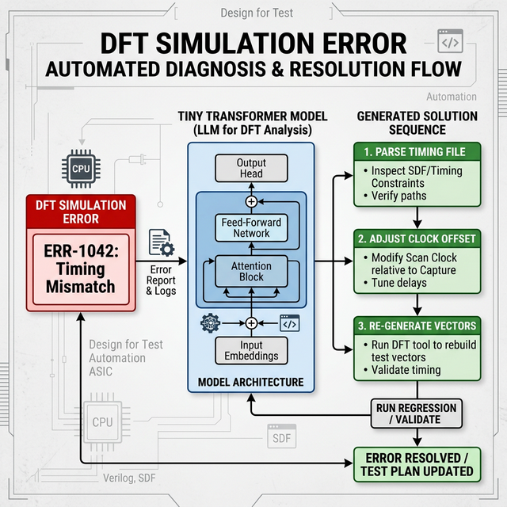

# Generic Error-to-Solution Mapping: Tiny Transformer in DFT Automation

## 1. Beyond Fixed Schemas: The Generic Case
The **Tiny Transformer** is not limited to database tables. It serves as a high-speed, local **Structural Reasoner** that maps:
> **Input ID (Error/Request)** $\rightarrow$ **Latent Intent Extraction** $\rightarrow$ **Step-by-Step Solution Sequence**

This is particularly powerful for complex technical environments like **Semiconductor Vector Conversion**, where a single error number can imply a multi-step correction workflow.

---

## 2. Case Study: DFT Simulation & Vector Conversion
In **Design For Test (DFT)**, converting simulation vectors to tester-ready formats often triggers timing mismatches or protocol violations.

### 2.1 The Problem
When a simulation fails, the tool outputs an **Error Number** (e.g., `ERR_TIMING_402`). A simple lookup table is insufficient because the *solution* requires a specific sequence of file modifications and tool re-runs based on the current project metadata.

### 2.2 Solution: Structural Generation
The Tiny Transformer takes the **Error ID** and **Timing Metadata** to generate an automated remediation workflow.



---

## 3. Example: Timing File Correction Sequence

### 3.1 Input
- **Error ID**: `ERR_VEC_STB_01` (Strobe Timing Mismatch in Vector Conversion)
- **Metadata**: `Tester: Teradyne J750`, `Protocol: I2C`, `Frequency: 100MHz`

### 3.2 AI-Generated Correction Workflow
| Step | Solution Operation | Action Taken |
| :--- | :--- | :--- |
| **1** | `(parse, timing_file, current)` | Load the `.atpg` or `.wgl` timing block. |
| **2** | `(calculate, strobe_offset, dynamic)` | Calculate the required 2ns shift based on metadata. |
| **3** | `(update, strobe_def, corrected)` | Modify the timing definition in the source file. |
| **4** | `(rerun, vec_convert, start)` | Trigger the conversion engine with updated timing. |
| **5** | `(verify, log_output, check)` | Ensure the error code is no longer present. |

---

## 4. Why Use a Tiny Transformer Here?
1. **Context Awareness**: Unlike a static FAQ, the AI knows that `ERR_VEC_STB_01` requires a different offset calculation for a 100MHz clock vs. a 400MHz clock.
2. **Sequential Reliability**: It ensures that a "Re-run" action only happens *after* the "Update" action is successfully simulated in the latent space.
3. **CPU Efficiency**: Since these errors occur during long-running batch conversions, the overhead for AI must be negligible. 8-bit quantization ensures the correction logic runs in milliseconds on the same machine running the simulator.

---

## 5. Generic Training Structure
For arbitrary error-to-solution mappings, the model uses this structure:
```json
{
  "context": {
    "error_code": "ERR_1042",
    "subsystem": "timing_engine",
    "params": {"freq": 100, "temp": "hot"}
  },
  "sequence": [
    "LOG_ERR_REPORT",
    "CALC_CALIBRATION_VAL",
    "PATCH_TIMING_CONFIG",
    "RELOAD_SIM_ENGINE"
  ]
}
```
