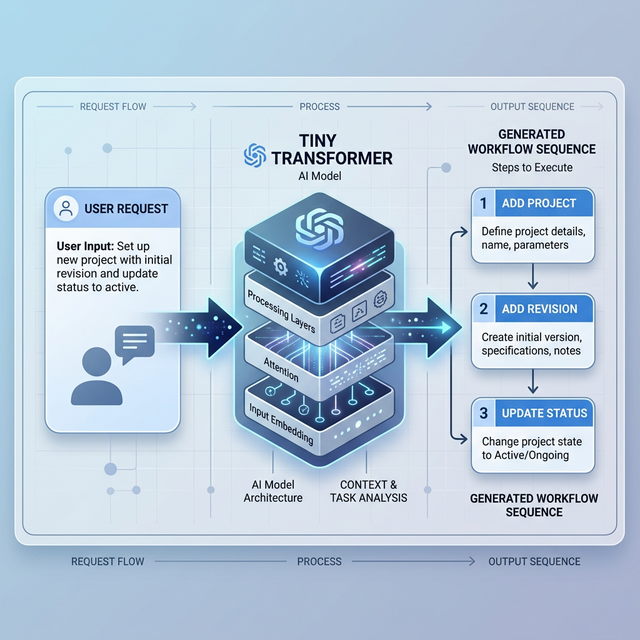

# Problem Statement & Solution: Tiny Transformer for DB Workflows

## 1. Problem Statement: The Cold-Start Workflow Challenge

### 1.1 Context
In large-scale database systems (e.g., project management, engineering metadata), complex entities like `projects`, `revisions`, and `blocks` have intricate relational dependencies. When a user submits a **new Request ID** (e.g., "Initialize a linear growing project structure"), the system doesn't have a pre-defined script for that specific request.

### 1.2 The Traditional Failure Points
1.  **Orphan Records**: Static scripts often fail to handle Foreign Key (FK) dependencies, leading to child entities (e.g., `revision`) being created before parent entities (`project`).
2.  **Rigidity**: A rule-based engine requires thousands of hard-coded paths for every possible combination of tables and actions (`add`, `remove`, `update`, `read`).
3.  **Inference Bottleneck**: Running a large language model (LLM) to "guess" the workflow is too slow for real-time database operations on standard CPUs.

---

## 2. Solution: Structural Sequence Prediction

### 2.1 The AI-Driven Approach
We replace rigid rule-based engines with a **Tiny Transformer** (2-4 layers, $d_{model}=128$). This model treats database workflows as a **sequence prediction problem**.

### 2.2 Core Logic
1.  **Latent Feature Mapping**: Instead of memorizing Request IDs, the model maps the **Pattern Type** (e.g., `linear_growth`) and **Block Relationships** into a latent vector.
2.  **Structural Integrity via Tokenization**: We use a unified triplet vocabulary `(Action, Table, State)`. The model "thinks" in valid database operations, not raw text.
3.  **Dependency-Aware Masking**: During the generation process, the model's output is "guided" by a schema-aware mask that prevents it from suggesting an `add` for a child table before its parent has been added.



---

## 3. Sample Workflow Generation (Case Study)

### 3.1 Input Context
- **Request Type**: `High-Priority New Project Setup`
- **Pattern Pattern**: `Linear Growth` (Sequential revisions)
- **Entities Involved**: `project`, `revision`, `block`, `block_fk`

### 3.2 Predicted AI Workflow
Based on the latent features of "Linear Growth," the Tiny Transformer generates the following sequence:

| Step | Operation Token | Logic/Validation |
| :--- | :--- | :--- |
| **1** | `(add, project, added)` | **Root Entity**: Must be created first. |
| **2** | `(add, revision, added)` | **Parent-Child**: Depends on `project` ID from Step 1. |
| **3** | `(add, block, added)` | **Structural**: Depends on `revision`. |
| **4** | `(add, block_fk, added)` | **Constraint**: Links `block` to its foreign keys. |
| **5** | `(update, project, updated)` | **Finalization**: Updates project status to 'active'. |
| **6** | `[EOS]` | **End of Sequence**: Signal for completion. |

### 3.3 What the API Receives
```json
{
  "request_id": "REQ-00123",
  "generated_workflow": [
    {"action": "add", "table": "project", "state": "added"},
    {"action": "add", "table": "revision", "state": "added"},
    {"action": "add", "table": "block", "state": "added"},
    {"action": "add", "table": "block_fk", "state": "added"},
    {"action": "update", "table": "project", "state": "updated"}
  ]
}
```

---

## 4. Key Advantages
- **Local CPUs**: Runs in < 50ms on a standard Intel/AMD CPU using 8-bit quantization.
- **FK Compliance**: Guaranteed by token-level structural integrity.
- **Extensibility**: To add a new entity (e.g., `phasing`), simply update the vocabulary and re-train on a small set of sample workflows (few-shot learning).
